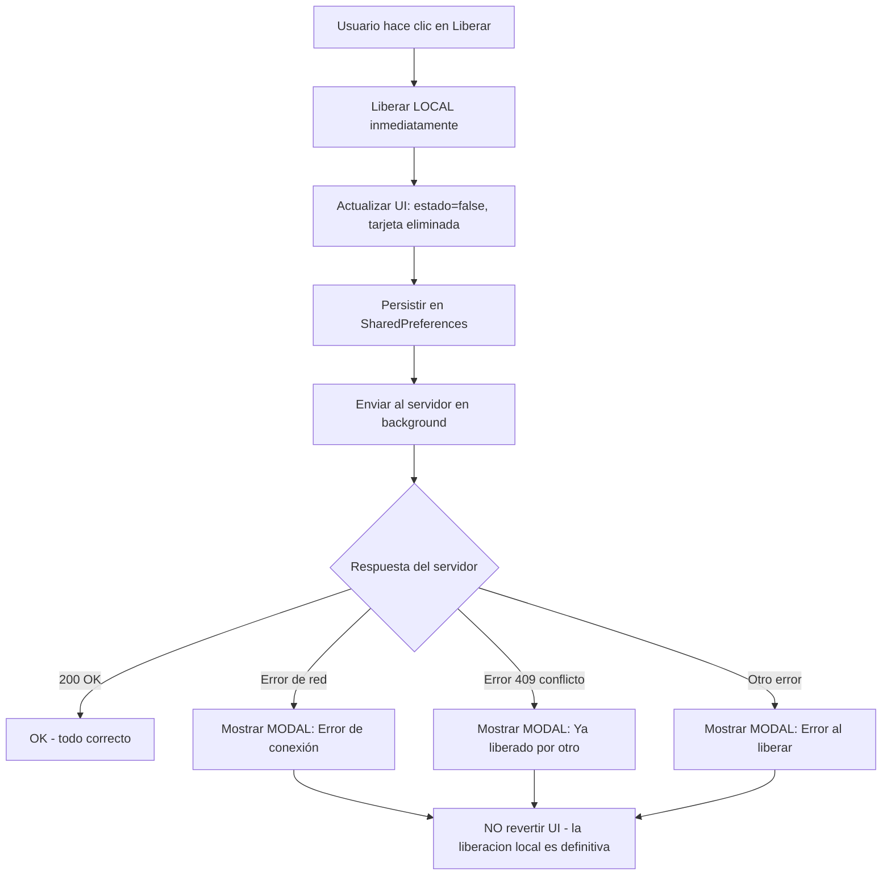

# Plan: Liberación Local Garantizada + Errores en Modal

## Problemas Identificados

### 1. Liberación con reversión incorrecta
En `_ejecutarLiberacion()` (línea 1386), si el servidor falla, se **revierte** la liberación local:
```dart
catch (e) {
  _updateUIAfterChange(estacionId, true, '');  // REVERTIR ocupado
  _estacionamientosTarjeta.addAll(tarjetaPrevia);  // RESTAURAR tarjeta
}
```
Esto es incorrecto porque:
- El usuario ya vio que se liberó
- La liberación local debe ser definitiva
- El error del servidor debe ser una advertencia, no una reversión

### 2. Errores sin feedback visual claro
Los errores se muestran con `_showCustomSnackBar()` que:
- Desaparece solo después de 4 segundos
- No permite al usuario leer el error con calma
- No diferencia entre errores críticos y advertencias

## Solución Propuesta

### Principios
1. **Liberación local es DEFINITIVA** — nunca se revierte
2. **Error del servidor = advertencia, no bloqueo** — la UI local es la fuente de verdad para el usuario
3. **Errores críticos en MODAL** — el usuario debe leerlos y cerrarlos explícitamente

### Diagrama de Flujo



### Cambios Específicos

#### Cambio A: `_ejecutarLiberacion()` — liberación local definitiva
**Archivo**: `lib/tarjetas/views/EstacionamientoScreen.dart`
**Líneas**: 1386-1437

Reemplazar el bloque `try/catch` actual por:
```dart
void _ejecutarLiberacion(int estacionId) {
  unawaited((() async {
    setState(() => _estacionamientosLiberando[estacionId] = true);
    _enProceso.add(estacionId);

    // 1. LIBERAR LOCAL INMEDIATAMENTE (siempre, sin importar el servidor)
    _updateUIAfterChange(estacionId, false, '');
    setState(() {
      _estacionamientosTarjeta.removeWhere((t) => t.estacionId == estacionId);
    });
    await _persistirCacheInmediato();
    _enviarTarjetasAlServicioNativo();

    // 2. SINCRONIZAR CON SERVIDOR EN BACKGROUND
    try {
      await actualizarRegistro(
        estacionId: estacionId, placa: '', estado: false, token: _token,
      );
      _fetchAndCacheEstacionamientosTarjeta();
    } catch (e) {
      // NO revertir la UI. Solo mostrar error en modal.
      _mostrarErrorModal(_mensajeErrorLiberacion(e));
    } finally {
      if (mounted) {
        setState(() => _estacionamientosLiberando.remove(estacionId));
      }
      Future.delayed(const Duration(seconds: 2), () => _enProceso.remove(estacionId));
    }
  })());
}
```

#### Cambio B: Nuevo método `_mostrarErrorModal()`
**Archivo**: `lib/tarjetas/views/EstacionamientoScreen.dart`
**Insertar**: después de `_showCustomSnackBar`

```dart
void _mostrarErrorModal(String mensaje) {
  if (!mounted || _appEnSegundoPlano) return;
  showDialog(
    context: context,
    barrierDismissible: false,
    builder: (ctx) => AlertDialog(
      title: Row(
        children: [
          Icon(Icons.error_outline, color: Colors.red.shade700, size: 24),
          SizedBox(width: 10),
          Text('Error', style: TextStyle(fontWeight: FontWeight.bold)),
        ],
      ),
      content: Text(mensaje, style: TextStyle(fontSize: 14)),
      actions: [
        TextButton(
          onPressed: () => Navigator.pop(ctx),
          child: Text('Cerrar', style: TextStyle(fontWeight: FontWeight.bold)),
        ),
      ],
    ),
  );
}
```

#### Cambio C: Nuevo método `_mensajeErrorLiberacion()`
**Archivo**: `lib/tarjetas/views/EstacionamientoScreen.dart`
**Insertar**: junto con `_mostrarErrorModal`

```dart
String _mensajeErrorLiberacion(dynamic error) {
  final msg = error.toString();
  if (msg.contains('SocketException') || msg.contains('HandshakeException') || 
      msg.contains('TimeoutException') || msg.contains('sin conexión')) {
    return 'No se pudo conectar con el servidor para liberar el estacionamiento.\n\n'
        'El estacionamiento ya fue liberado localmente. '
        'Los cambios se sincronizarán automáticamente cuando la conexión se restablezca.';
  }
  if (msg.contains('409') || msg.contains('Conflict')) {
    return 'El estacionamiento ya fue liberado por otro usuario.\n\n'
        'No es necesario realizar ninguna acción adicional.';
  }
  if (msg.contains('401') || msg.contains('No autorizado')) {
    return 'Su sesión ha expirado. Por favor, cierre sesión y vuelva a iniciarla.';
  }
  return 'Ocurrió un error al liberar el estacionamiento: ${msg.length > 200 ? msg.substring(0, 200) : msg}\n\n'
      'El estacionamiento ya fue liberado localmente. '
      'Si el problema persiste, contacte al administrador.';
}
```

#### Cambio D: `_liberarEstacionamientoExpirado()` — mismo patrón
**Archivo**: `lib/tarjetas/views/EstacionamientoScreen.dart`
**Líneas**: 1340-1383

Mantener la liberación local inmediata, pero mejorar el error del servidor:
```dart
// En lugar de solo debugPrint, mostrar modal si hay error
catch (e) {
  debugPrint('[ADVERTENCIA]  Error al liberar en servidor: $e');
  _mostrarErrorModal(_mensajeErrorLiberacion(e));
}
```

#### Cambio E: Error en registro — modal en lugar de SnackBar
**Archivo**: `lib/tarjetas/views/EstacionamientoScreen.dart`
**Línea**: ~3232 (catch del registro)

Reemplazar `_showCustomSnackBar` por `_mostrarErrorModal`:
```dart
catch (e) {
  // ... revertir local ...
  _mostrarErrorModal(_mensajeErrorRegistro(e));
}
```

#### Cambio F: Nuevo método `_mensajeErrorRegistro()`
```dart
String _mensajeErrorRegistro(dynamic error) {
  final msg = error.toString();
  if (msg.contains('SocketException') || msg.contains('HandshakeException') || 
      msg.contains('TimeoutException')) {
    return 'No se pudo conectar con el servidor para registrar el estacionamiento.\n\n'
        'El registro se ha guardado localmente. '
        'Los cambios se sincronizarán automáticamente cuando la conexión se restablezca.';
  }
  if (msg.contains('409') || msg.contains('Conflict')) {
    return 'Este estacionamiento ya fue registrado por otro usuario.\n\n'
        'Por favor, seleccione otro espacio disponible.';
  }
  if (msg.contains('400')) {
    return 'Los datos ingresados no son válidos.\n\n'
        'Verifique que la placa y el número de tarjeta sean correctos.';
  }
  return 'Ocurrió un error al registrar: ${msg.length > 200 ? msg.substring(0, 200) : msg}';
}
```

## Resumen de Archivos a Modificar

| Archivo | Cambios |
|---------|---------|
| `lib/tarjetas/views/EstacionamientoScreen.dart` | 6 cambios (A, B, C, D, E, F) |

## Pruebas de Verificación

1. **Liberación con éxito**: Liberar estacionamiento → UI se actualiza inmediatamente → servidor responde OK → no hay modal
2. **Liberación sin conexión**: Liberar estacionamiento sin internet → UI se actualiza inmediatamente → modal de error de conexión → NO se revierte la UI
3. **Liberación con conflicto (409)**: Liberar estacionamiento que otro ya liberó → UI se actualiza → modal de conflicto
4. **Registro sin conexión**: Registrar estacionamiento sin internet → modal de error de conexión → datos guardados localmente
5. **Registro con conflicto (409)**: Registrar estacionamiento ya ocupado → modal de conflicto
