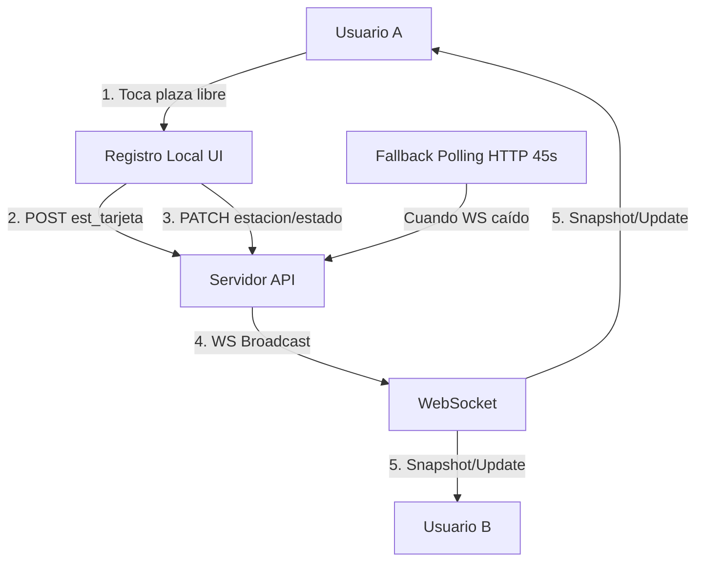
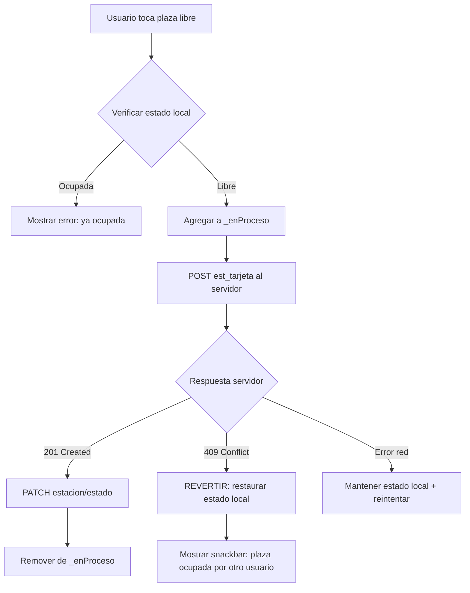
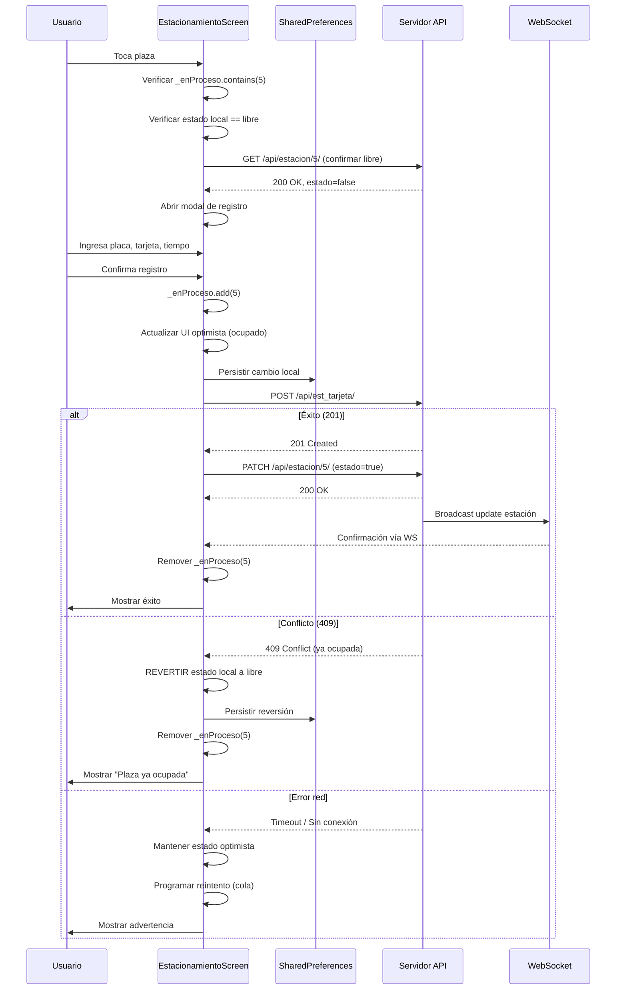
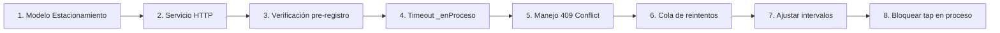

# Plan: Sincronización en Tiempo Real para Registro de Estacionamientos

## Problema Identificado

Múltiples dispositivos registran estacionamientos simultáneamente. Cuando el WebSocket (WS) se cae o hay latencia, dos usuarios pueden registrar la misma plaza como ocupada porque:
1. El estado local se actualiza **antes** de confirmar con el servidor
2. No hay un **bloqueo optimista** (optimistic lock) que impida doble registro
3. El servidor no tiene un mecanismo de **validación server-side** que rechace registros duplicados
4. El caché local (`SharedPreferences`) puede tener datos obsoletos

## Arquitectura Actual



**Problema clave:** Los pasos 2 y 3 se ejecutan secuencialmente pero sin validación server-side de que la plaza sigue libre. Si el Usuario B también intenta registrar la misma plaza entre los pasos 2 y 3, ambos registros pueden tener éxito.

## Solución Propuesta

### 1. Validación Server-Side (Backend)

El servidor **DEBE** rechazar un registro si la estación ya está ocupada. Esto es responsabilidad del backend, pero debemos contemplarlo en el plan.

**API `POST /api/est_tarjeta/`** debe:
- Verificar que `estacion` no tenga un registro activo (sin `hora_salida` expirada)
- Retornar `409 Conflict` si ya está ocupada
- Retornar el registro actual en el cuerpo de la respuesta para que el cliente pueda sincronizarse

### 2. Bloqueo Optimista Local (Optimistic Lock)

Antes de registrar, el cliente debe **verificar localmente** que la plaza sigue libre, usando una **versión** o **timestamp** de la estación.



### 3. Mejora del Mecanismo de Protección `_enProceso`

Actualmente `_enProceso` solo protege contra sobreescritura por WS/polling. Debemos extenderlo para:

- **Bloquear el tap** en la tarjeta de estación mientras está en proceso
- **Timeout** de seguridad: si una operación en `_enProceso` dura más de 15 segundos, liberar automáticamente
- **Cola de reintentos** para operaciones fallidas por red

### 4. Sincronización Forzada al Abrir el Formulario

Cuando el usuario toca una plaza libre para registrar, **antes** de abrir el modal:
1. Hacer una verificación rápida al servidor (`GET /api/estacion/{id}/`) para confirmar que sigue libre
2. Si el servidor dice que está ocupada, actualizar UI y mostrar mensaje
3. Si no hay conexión, confiar en el estado local pero mostrar advertencia

### 5. Cache Local con Versión (Timestamp)

Cada estación debe tener un `version` o `updated_at` para detectar conflictos:

```dart
class Estacionamiento {
  final int id;
  final int numero;
  final String direccion;
  final String placa;
  final bool estado;
  final String updatedAt; // Nuevo campo: ISO timestamp del servidor
}
```

Al hacer merge de datos del servidor (WS o polling), comparar `updatedAt`:
- Si el servidor tiene una versión más nueva, usar la del servidor
- Si el local tiene una versión más nueva (operación en curso), mantener la local

### 6. Reducción de Latencia de Sincronización

| Mecanismo | Estado Actual | Propuesto |
|-----------|--------------|-----------|
| WebSocket | 45s heartbeat | 30s heartbeat |
| Fallback Polling | 45s | 20s (más agresivo cuando WS caído) |
| Recarga de Caché | 15s | 10s |
| Debounce de Persistencia | 2s | 1s |
| Timeout de _enProceso | Ninguno | 15s |

### 7. Mejora en el Manejo de Error del Servidor

Cuando `POST /api/est_tarjeta/` falla con `409 Conflict` (plaza ya ocupada):
1. **NO** marcar la estación como ocupada localmente
2. Forzar recarga inmediata de esa estación desde el servidor
3. Mostrar mensaje claro: "La plaza #X ya fue ocupada por otro usuario"

Cuando falla por red (timeout):
1. Mantener el estado local (optimistic update)
2. Agregar a una **cola de reintentos** con back-off exponencial
3. Mostrar advertencia: "Registro guardado localmente, sincronizando..."

## Diagrama de Flujo Completo



## Archivos a Modificar

### 1. `lib/tarjetas/models/Estacionamiento.dart`
- Agregar campo `updatedAt` (String, opcional)
- Actualizar `fromJson` y `toJson`

### 2. `lib/tarjetas/views/EstacionamientoScreen.dart`
- Agregar **verificación server-side** antes de abrir modal (`_verificarEstadoAntesDeRegistrar`)
- Agregar **timeout de seguridad** para `_enProceso` (15s)
- Agregar **cola de reintentos** para operaciones fallidas
- Mejorar el manejo de error `409 Conflict` con reversión local
- Reducir intervalos: polling 20s, caché 10s, persistencia 1s
- Bloquear tap en estaciones que están en `_enProceso`

### 3. `lib/servicios/servicioEstacionamiento.dart`
- Agregar función `fetchEstacionamientoPorId(id)` para verificación rápida
- Mejorar `actualizarRegistro` para manejar `409 Conflict`

### 4. `lib/servicios/servicioEstacionamientoTarjeta.dart`
- Mejorar `registarEstacionamientoTarjeta` para propagar errores `409` específicamente

### 5. `lib/servicios/servicioWebSocket.dart`
- Reducir heartbeat de 45s a 30s

## Tareas de Implementación



### Orden de Implementación

1. **Modelo**: Agregar `updatedAt` a `Estacionamiento`
2. **Servicios**: Agregar `fetchEstacionamientoPorId` y mejorar manejo de errores
3. **Verificación pre-registro**: Antes de abrir modal, verificar con servidor
4. **Timeout `_enProceso`**: Timer de 15s que libere automáticamente
5. **Manejo 409**: Revertir estado local cuando el servidor rechaza
6. **Cola de reintentos**: Para operaciones que fallan por red
7. **Ajustar intervalos**: Polling 20s, caché 10s, persistencia 1s, heartbeat 30s
8. **UI**: Bloquear tap visualmente en estaciones en proceso

## Consideraciones

- **Backward Compatibility**: El campo `updatedAt` debe ser opcional para no romper con datos en caché existentes
- **Consumo de Datos**: La verificación pre-registro agrega 1 GET adicional por registro. Aceptable.
- **Offline First**: Si no hay conexión, se confía en el estado local con advertencia
- **Notificaciones Push**: OneSignal sigue siendo un canal adicional de actualización
