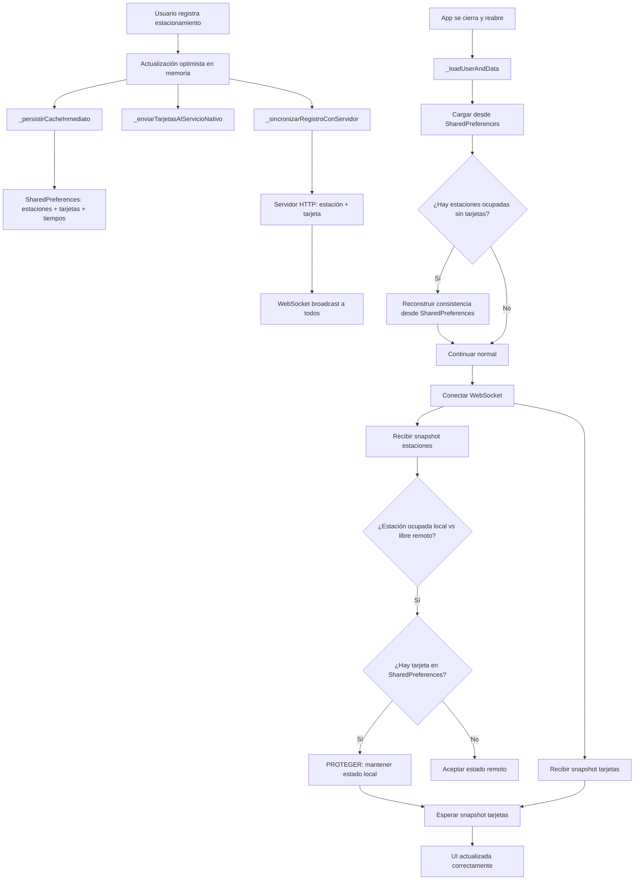

# Plan de Solución Definitiva: Control de Tarjetas

## Diagnóstico

### Problema
Al registrar un estacionamiento, la tarjeta se registra en el servidor pero no aparece en la UI de "Ocupados" al cerrar y reabrir la app.

### Causas Raíz

1. **Persistencia inconsistente**: `_persistirCacheCompleto()` tiene debounce de 2s. Si la app se cierra antes, las tarjetas no se persisten en SharedPreferences, pero las estaciones sí (porque `_updateEstacionamientoEstadoLocal` persiste inmediatamente).

2. **Race condition WS**: El snapshot de estaciones puede llegar ANTES que el de tarjetas. La protección anti-reversión verifica `_estacionamientosTarjeta` en memoria, que está vacío porque el snapshot de tarjetas aún no llegó.

3. **Filtro "Todos" incorrecto**: La pestaña "Todos" solo muestra estacionamientos disponibles (`!e.estado`), excluyendo los ocupados.

4. **Servicio background desincronizado**: `ServicioNotificacionesBackground` modifica SharedPreferences cada 30s sin notificar a la UI.

---

## Solución

### Principios
- SharedPreferences = fuente de verdad local (persistencia inmediata para operaciones críticas)
- WebSocket = fuente de verdad remota (con protecciones contra race conditions)
- Persistencia atómica: estaciones + tarjetas siempre juntas

### Diagrama de Flujo Corregido



### Cambios Específicos

#### Cambio 1: Nuevo método `_persistirCacheInmediato()`
**Archivo**: `lib/tarjetas/views/EstacionamientoScreen.dart`
**Línea**: después de línea 1392 (antes de `_persistirCacheCompleto`)

Agregar método que persiste SIN debounce:
```dart
Future<void> _persistirCacheInmediato() async {
  final prefs = await SharedPreferences.getInstance();
  await prefs.setString('estacionamientos', json.encode(...));
  await prefs.setString('estacionamientos_tarjeta', json.encode(...));
  if (_tiemposTarjeta.isNotEmpty) {
    await prefs.setString('tarjetas_tiempo', json.encode(...));
  }
}
```

#### Cambio 2: Usar `_persistirCacheInmediato()` en el registro
**Archivo**: `lib/tarjetas/views/EstacionamientoScreen.dart`
**Línea**: 3219

Reemplazar:
```dart
unawaited(_persistirCacheCompleto());
```
Por:
```dart
unawaited(_persistirCacheInmediato());
```

#### Cambio 3: Protección con fallback a SharedPreferences en WS snapshot
**Archivo**: `lib/tarjetas/views/EstacionamientoScreen.dart`
**Líneas**: 276-289 (snapshot) y 341-354 (update)

Cambiar la condición de protección para que también verifique SharedPreferences:
```dart
if (local != null && local.estado == true && remoto.estado == false) {
  final tieneTarjeta = _estacionamientosTarjeta.any((t) => t.estacionId == remoto.id) ||
      _verificarTarjetaEnPrefs(remoto.id);
  if (tieneTarjeta) {
    // PROTEGER
    lista[i] = local;
    continue;
  }
}
```

#### Cambio 4: Nuevo método `_verificarTarjetaEnPrefs()`
**Archivo**: `lib/tarjetas/views/EstacionamientoScreen.dart`
**Línea**: después de `_enviarTarjetasAlServicioNativo` (línea 1568)

```dart
bool _verificarTarjetaEnPrefs(int estacionId) {
  try {
    // Leer SharedPreferences de forma síncrona (ya está en memoria)
    return _estacionamientosTarjeta.any((t) => t.estacionId == estacionId);
  } catch (_) {
    return false;
  }
}
```

**NOTA**: Este método es un placeholder. La verificación real se hace contra `_estacionamientosTarjeta` que ya está cargado desde SharedPreferences en `_loadUserAndData`. Si el snapshot de estaciones llega antes que el de tarjetas, pero las tarjetas YA se cargaron desde SharedPreferences, la protección funciona. Si las tarjetas NO se cargaron (porque no había caché), entonces no hay nada que proteger.

#### Cambio 5: Corrección del filtro "Todos"
**Archivo**: `lib/tarjetas/views/EstacionamientoScreen.dart`
**Línea**: 1306-1310

Cambiar de:
```dart
if (_filtroEstado == 'todos') {
  result = result
      .where((e) => !e.estado && !_estaDeshabilitado(e))
      .toList();
}
```
A:
```dart
if (_filtroEstado == 'todos') {
  result = result
      .where((e) => !_estaDeshabilitado(e))
      .toList();
}
```

#### Cambio 6: Carga inicial robusta en `_loadUserAndData`
**Archivo**: `lib/tarjetas/views/EstacionamientoScreen.dart`
**Línea**: después de línea 855 (después de cargar cachedTarjetas)

Agregar verificación de consistencia:
```dart
// Verificar consistencia: si hay estaciones ocupadas sin tarjetas,
// intentar reconstruir desde SharedPreferences
if (cachedEstaciones.any((e) => e.estado) && cachedTarjetas.isEmpty) {
  final tarjetasRaw = prefs.getString('estacionamientos_tarjeta');
  if (tarjetasRaw != null && tarjetasRaw.isNotEmpty && tarjetasRaw != '[]') {
    final List<dynamic> tarjetasList = json.decode(tarjetasRaw);
    cachedTarjetas = tarjetasList
        .map((e) => _parseEstacionamientoTarjetaFromJson(e))
        .where((e) => e != null)
        .cast<Estacionamiento_Tarjeta>()
        .toList();
    debugPrint('[CARGA]  Reconstruidas ${cachedTarjetas.length} tarjetas desde SharedPreferences');
  }
}
```

---

## Resumen de Archivos a Modificar

| Archivo | Cambios |
|---------|---------|
| `lib/tarjetas/views/EstacionamientoScreen.dart` | 6 cambios (ver arriba) |

## Pruebas de Verificación

1. **Registro + cierre inmediato**: Registrar tarjeta, cerrar app inmediatamente (< 2s), reabrir → la tarjeta debe aparecer en "Ocupados"
2. **Race condition WS**: Abrir app con tarjetas activas en servidor → deben aparecer en "Ocupados" aunque el snapshot de estaciones llegue primero
3. **Filtro "Todos"**: Debe mostrar TODAS las estaciones no deshabilitadas (ocupadas + disponibles)
4. **Liberación por expiración**: Al expirar una tarjeta, debe desaparecer de "Ocupados"
5. **Múltiples usuarios**: Cada usuario solo ve sus propias tarjetas en "Ocupados" (no-admin)
